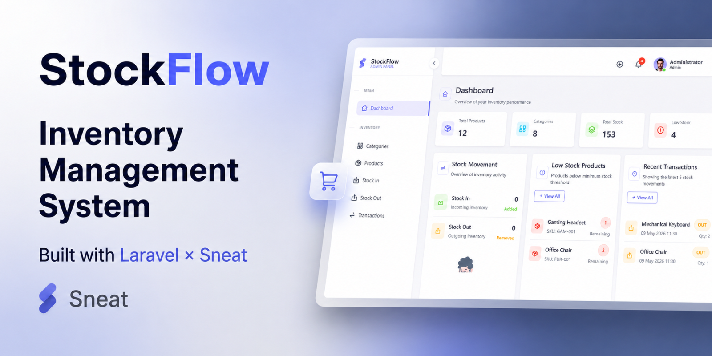

# Gunawan — Full Stack Web Developer

## About Me

I am a Full Stack Web Developer focused on building modern and responsive web applications using Laravel, React.js, and Node.js.

I enjoy creating clean, scalable, and user-friendly systems with well-structured architecture and polished interfaces.

---

# Tech Stack

## Frontend

- React.js
- JavaScript
- Bootstrap 5
- jQuery

## Backend

- Laravel
- Node.js
- Express.js

## Database

- MySQL
- MongoDB

---

# Featured Project

## StockFlow v1.0 — Inventory Management System

Modern inventory management system built with Laravel and Sneat Admin Dashboard.

### View Project

https://github.com/Guunawan/stockflow-v1.0

### Features

- Dashboard analytics
- Product management
- Category management
- Stock in & stock out system
- Inventory transaction history
- Stock alert notifications
- Responsive layout
- Clean architecture structure
- Reusable Blade components
- Filtering, sorting, and pagination

### Technology

- Laravel 12
- Bootstrap 5
- Sneat Admin Dashboard
- MySQL

---

# Other Projects

- Web Laundry Management System
- Warehouse Management System
- Sistem Serah Terima Barang (PKL JNE)

---

# Contact

Email: gunawanradit1@gmail.com
